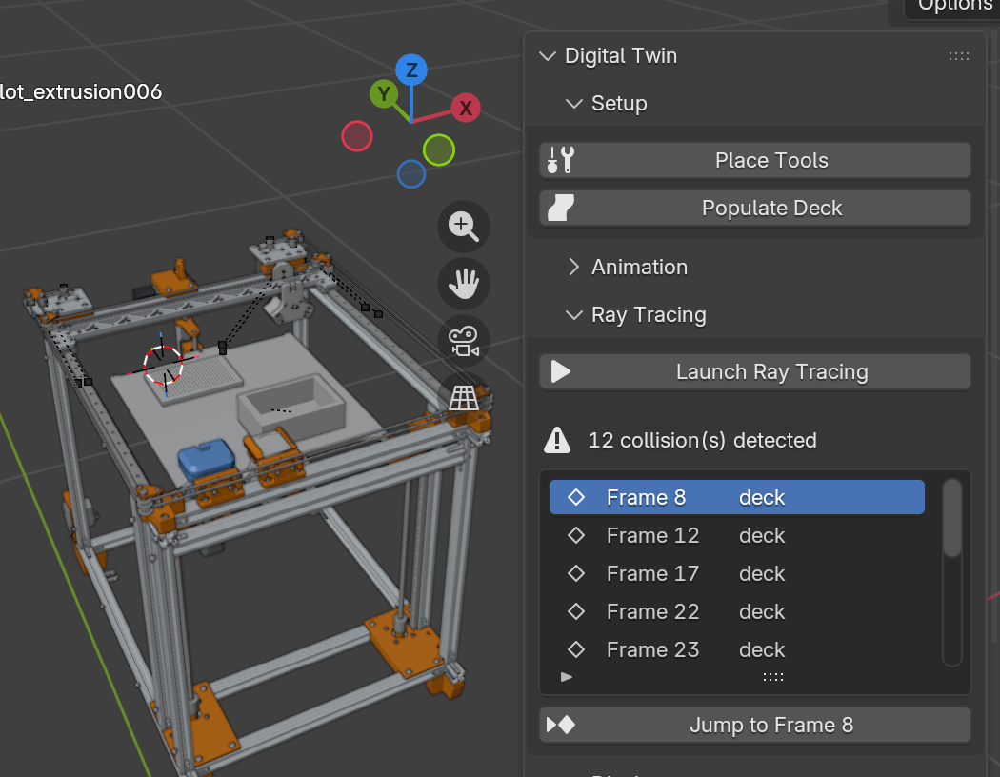
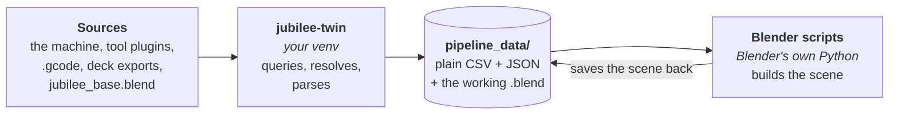
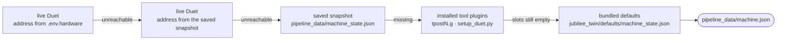
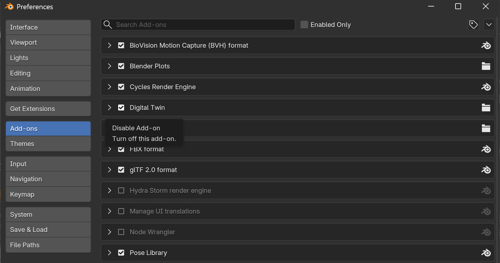
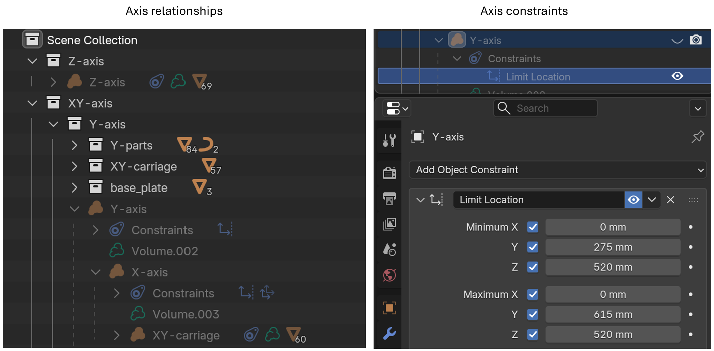
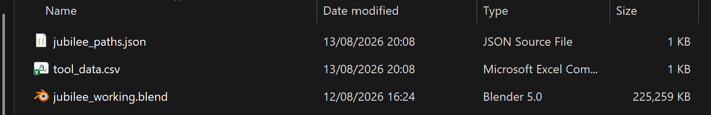
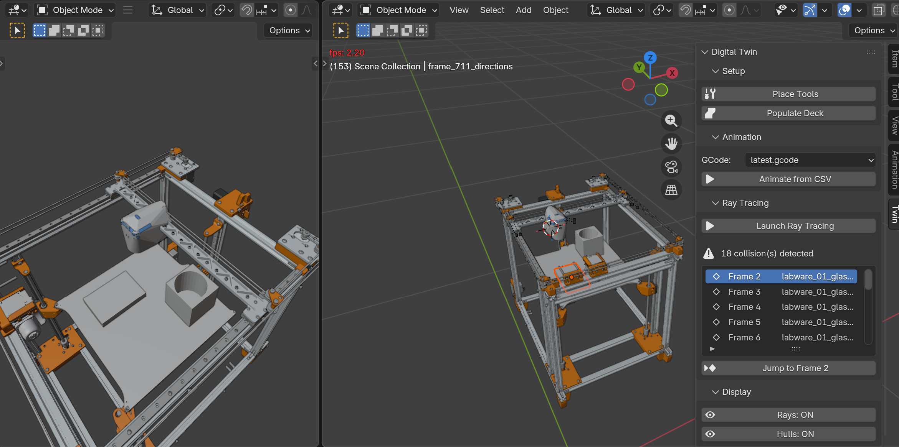
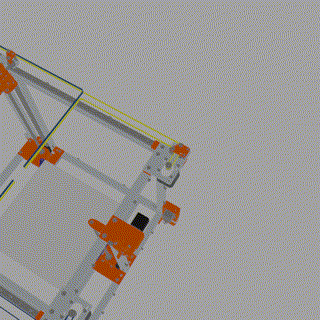

# Jubilee Blender Twin

A Blender-based *digital twin* of the [Jubilee](https://github.com/machineagency/jubilee) open-source motion platform. Visualize toolpaths, place labware, detect collisions, and record reproducible GIFs — all driven from Python.


---

## Table of contents

1. [Who this is for](#who-this-is-for)
2. [Architecture and plugin connections](#architecture-and-plugin-connections)
   - [Where each piece of data comes from](#where-each-piece-of-data-comes-from)
3. [Installation](#installation)
4. [The Blender base file](#the-blender-base-file)
5. [Full pipeline: CLI workflow](#full-pipeline-cli-workflow)
   - [Scripting snapshots from pure Python](#scripting-snapshots-from-pure-python)
6. [Full pipeline: Blender addon workflow](#full-pipeline-blender-addon-workflow)
7. [Virtual image acquisition](#virtual-scanner-subpanel)
8. [Connecting the interface app](#connecting-the-interface-app)
9. [Collision detection](#collision-detection)
10. [Recording GIFs with Sacred](#recording-gifs-with-sacred)
11. [Configuration: animation_config.json](#configuration-animation_configjson)

---

## Who this is for

This repo targets people who:

- Have (or plan to build) a Jubilee and want a **digital twin** driven from Python.
- Want to visualize **experiment layouts** (labware, tools) generated by the interface app.
- Want to check toolpaths for **collisions** before running on real hardware.
- Want reproducible, documented GIFs of experiments with metadata tracked in a database.

---

## Architecture and plugin connections

`jubilee-blender-twin` runs standalone, and can optionally connect to other
Jubilee packages through the `jubilee.paths` entry-point group.

```
science_jubilee            ← machine control, G-code logs, camera calibration
  ├─ pipeline_data/         ← recorded experiments and machine snapshot
  │   └─ gcode_logs/        ← .gcode files
  └─ calibration/          ← camera_params.yaml

science-jubilee-interface  ← GUI for deck/experiment design
  └─ experiment_deck/       ← per-experiment folders with deck.json + deck.blend

<tool plugin repos>        ← one pip-installable package per tool (e.g. tool-pen-maag)
  ├─ twin_assets/           ← tool.blend, park post, optional twin.json manifest
  └─ templates/             ← tpre/tpost/tfree Duet macros (offline park positions)

jubilee-blender-twin       ← this repo
  ├─ jubilee_twin/          ← Python package (CLI + TwinDriver)
  ├─ blender_addon/         ← Blender addon (jubilee_digital_twin.zip)
  ├─ blender_models/        ← jubilee_base.blend (version-controlled base scene)
  ├─ pipeline_data/         ← generated at runtime (CSVs, working .blend, paths cache)
  └─ Tools/                 ← legacy per-tool .blend files (fallback only)
```

### Optional package connections

Python [entry points](https://packaging.python.org/en/latest/specifications/entry-points/) are small metadata records that a package writes into your environment when you install it. You don't create them manually — they appear automatically the moment you run `pip install -e path/to/package`.

Each Jubilee package uses the `jubilee.paths` entry-point group to advertise its own root directory:

| Entry point | Returns | Registered by |
|---|---|---|
| `jubilee_dir` | `science_jubilee/` root | `science_jubilee` |
| `interface_dir` | `science-jubilee-interface/` root | `science-jubilee-interface` |
| `twin_dir` | `jubilee-blender-twin/` root | `jubilee-blender-twin` |
| `camera_params_yaml` | path to camera calibration YAML | `science_jubilee` |

Tool plugins use a separate group, `science_jubilee.tools.twin_assets`, to
advertise their `twin_assets/` directory. One entry per installed tool:

| Entry point group | Returns | Registered by |
|---|---|---|
| `science_jubilee.tools.twin_assets` | the tool's `twin_assets/` directory | every tool plugin package |

Only the packages whose integration you intend to use must be installed into
the same virtual environment. If an optional package is installed, install it
with `pip install -e` so its entry point is registered and the twin can locate
it. The core twin and its default scene do not require any of these packages.

| Optional package | What it adds | Needed for the core twin? |
|---|---|---|
| `science-jubilee` | Live/saved machine state, G-code logs, and `camera_params.yaml` calibration | No |
| `science-jubilee-interface` | Experiment deck exports and the **Populate Deck** workflow | No |
| tool plugins (e.g. `tool-pen-maag`) | 3D models for each tool, plus offline park positions and offsets | No |

Without `science-jubilee`, the twin uses its bundled camera calibration and a
generic four-tool machine state with standard parking positions. Provide a
path to a local G-code file instead of a bare filename. The defaults are useful
for visualization; install `science-jubilee` when the scene must reflect a
specific machine's tool configuration or live state.


### The Blender addon

The Blender addon (`blender_addon/jubilee_digital_twin/`) is a separate installation alongside the Python packages. It adds a **Twin** panel to Blender's N-panel sidebar with buttons for placing tools, loading labware, running animations, and detecting collisions. It reads inpute from the `pipeline_data` folder that is generated via python scripts: see below.

Installing the addon is covered in [Installation → Install the Blender addon](#4-install-the-blender-addon). Using it is covered in [Full pipeline: Blender addon workflow](#full-pipeline-blender-addon-workflow).



#### The paths cache: jubilee_paths.json

The CLI tool (`jubilee-twin`) runs in your virtual environment and can resolve installed optional-package entry points at any time. Blender cannot — it ships its own bundled Python that is completely separate from your venv and has no knowledge of what is installed there.

To bridge this gap, the CLI writes a simple JSON file, `pipeline_data/jubilee_paths.json`, that maps each entry-point name to an absolute path on disk. The Blender addon reads this file on every operation, so it always knows where `science_jubilee/`, `science-jubilee-interface/`, etc. are located, without needing access to your venv.

`pipeline_data/jubilee_paths.json` is generated by `jubilee-twin setup-scene` (covered in [Full pipeline: CLI workflow](#full-pipeline-cli-workflow)). Run `setup-scene` before an addon operation that uses generated pipeline data or needs to find an optional package.


Example `pipeline_data/jubilee_paths.json` after running `setup-scene`:

```json
{
  "twin_dir": "C:/Users/you/repos/jubilee-blender-twin",
  "jubilee_dir": "C:/Users/you/repos/science-jubilee",
  "interface_dir": "C:/Users/you/repos/science-jubilee-interface",
  "env_hardware": "C:/Users/you/repos/science-jubilee/.env.hardware",
  "camera_params_source": "C:/Users/you/repos/science-jubilee/calibration/camera_params.yaml",
  "camera_params": { "fx": 1467.554, "fy": 1476.769, "cx": 961.213, "cy": 538.565, "dist": [], "offset": [0, 0, 0] }
}
```

The `env_hardware` key is written only when `science_jubilee/.env.hardware` exists. The Blender addon reads it to reach the live machine IP without needing access to your venv. The `camera_params` block is inlined from the YAML so the Blender addon never needs to parse YAML itself. If `science_jubilee` does not register `camera_params_yaml`, a bundled fallback (`jubilee_twin/defaults/camera_params.yaml`) is used. In a standalone installation the cache contains `twin_dir` and the bundled camera defaults.

---

### Where each piece of data comes from

The twin is split in two by a hard constraint: **Blender ships its own Python and
cannot see your virtual environment.** So the addon can never call
`science_jubilee`, resolve an entry point, or ask the Duet anything.

Everything follows from that. The `jubilee-twin` CLI runs in your venv, where it
*can* do those things, and it writes what it learns as plain files into
`pipeline_data/`. Blender then only reads those files. `pipeline_data/` is the
wall between the two worlds.



So when you wonder where a number in the scene came from, the answer is always
a file in `pipeline_data/`, and the question becomes which CLI step wrote it:

| File | Written by | Holds |
|---|---|---|
| `machine.json` | `pipeline/tool_id.py` | the whole machine: head position, active tool, and one record per tool slot (name, park, offsets, and which model to load) |
| `pathout.csv` | `pipeline/path_follower.py` | the sampled toolpath, one row per step |
| `jubilee_paths.json` | `driver.py` | package roots and camera calibration, inlined as absolute paths |
| `jubilee_working.blend` | `driver.py`, then the Blender scripts | the scene itself |
| `traces/<command>.html` | every step that did a fallback walk | one page of what was tried, what failed, and what won, with clickable paths |

And on the Blender side, which script consumes what:

| Script | Reads | Writes |
|---|---|---|
| `tool_placement.py` | `machine.json` | working blend |
| `place_camera.py` | `jubilee_paths.json` (`camera_params`) | working blend |
| `populate_deck.py` | `jubilee_paths.json` (`interface_dir`), the experiment's `deck.blend` | working blend |
| `animate_path.py` | `pathout.csv`, `machine.json` | working blend |
| `ray_tracing.py` | `pathout.csv`, `machine.json` | collision report |

For tools specifically, only two of those files matter: `machine.json` is the
complete per-slot record — what the machine says *and* which model to load — and
`jubilee_paths.json` covers everything else the venv knows that Blender cannot
discover on its own.

#### Machine state — names, park positions, offsets

`pipeline/tool_id.py` walks a fallback chain and stops at the first source that
answers. Whatever it ends up using is printed as `Machine state: <source>`.



The first step that answers wins and writes `machine.json` straight away; the
arrows are the failure path.

> **What is the saved snapshot?** Every time you open a `science_jubilee` session,
> its `RecordingTransport` asks the machine for a summary and writes it to
> `science_jubilee/pipeline_data/machine_state.json` — tool names, offsets, park
> positions, axis positions and the machine's address. It is a snapshot of the
> last time you were actually connected, so the twin can reproduce that machine's
> layout when the hardware is switched off. Its `address` field is also what the
> second step retries a live query against.

| Source | When it is used | What you get |
|---|---|---|
| Live Duet, address from `.env.hardware` | `JUBILEE_TRANSPORT=hardware` and `JUBILEE_ADDRESS` is set | the machine as it is right now |
| Live Duet, address from the saved snapshot | no usable `.env.hardware`, but the snapshot records an `address` | the machine as it is right now |
| Contents of the saved snapshot | that address did not respond | the machine as it was the last time you connected |
| Installed tool plugins | there is no snapshot at all | only the tools you have installed, at their calibrated park positions |
| Bundled defaults | always, for whatever is still missing | a generic four-slot Jubilee |

The two live rows differ only in *where the IP comes from*, not in what they
return. The row after them is the one that stops talking to hardware and reads
the snapshot's contents instead.

The last two combine: plugin data is applied first, then the generic four-slot
table backfills the rest. Plugin data is also merged into a *live* state, but
only into slots the machine reported as unnamed or empty — the Duet always wins
per slot. The result is written to `pipeline_data/machine.json`:

```json
{
  "source": "live (192.168.1.2)",
  "head_position": { "X": 0.0, "Y": 0.0, "Z": 0.0 },
  "active_tool": -1,
  "tools": [
    {
      "id": 0,
      "name": "tool_pen_maag",
      "park": [277.0, 342.0, 0.0],
      "offsets": [0.0, 0.0, 0.0],
      "blend": "C:/.../tool-pen-maag/twin_assets/blend/tool.blend",
      "park_post": "C:/.../tool-pen-maag/templates/park_post_47.blend"
    }
  ]
}
```

| Field | Source |
|---|---|
| `source` | which step of the chain above answered |
| `head_position`, `active_tool` | machine; `null` when nothing live answered |
| `name`, `park`, `offsets` | machine, else plugin, else bundled defaults |
| `blend`, `park_post` | the installed tool plugins |

The machine fields and the model fields are resolved in the same pass: each
slot's `name` is matched against the plugins' alias tables. That match happens
here, in the venv, so the Blender side only ever reads absolute paths.

#### Seeing what actually happened

Every run writes `pipeline_data/traces/<command>.html` — `setup-scene.html`,
`animate.html`, and so on — one page showing every fallback walk that command
took. Open it in any browser. Each step is a card:

| Colour | Meaning |
|---|---|
| green ✓ | answered — this is the one that won |
| red ✕ | tried and failed |
| grey – | skipped (e.g. autodiscovery bypassed by an explicit `machine_state_path`) |
| orange + | partially satisfied — e.g. a plugin matched a tool name but ships no `.blend` |

Every path is shown in full and is a clickable `file://` link, so you can jump
straight to the `.blend` a tool resolved to or the `.g` macro a park position was
read from. Paths that were looked for but do not exist are marked `(missing)`.

The recap is grouped into one card per walk:

| Section | Answers |
|---|---|
| **Package paths** | which `jubilee.paths` entry points resolved, and whether `.env.hardware` was found |
| **Camera calibration** | whether intrinsics came from `science_jubilee` or the bundled fallback |
| **Machine state** | the live → snapshot → plugins → defaults chain described above |
| **Tool plugins** | every installed plugin: was a `tool.blend` found, was an offline park position derivable |
| **Tool models** | per slot, which plugin matched the machine's tool name |

The files produced are listed underneath with their full contents, and the whole
run log is embedded at the bottom as a collapsible, timestamped table with the
same clickable paths. So one page answers “where did this come from”, “what did
we end up with”, and “what happened, in order”.

The cards and the log are complementary rather than redundant: the cards are the
structured *why* (only decision points, grouped by walk, colour-coded), the log
is the chronological *what* (every step, including progress messages and Blender
subprocess output that would only add noise to the cards).

The renderer ([jubilee_twin/trace.py](jubilee_twin/trace.py)) writes
self-contained HTML with the standard library only — no graphviz, no matplotlib,
no external CSS — so it works unchanged inside Blender's bundled Python.
`pipeline_data/` is git-ignored, so traces are never committed.

#### Tool plugin data

`jubilee_twin/tool_plugins.py` reads each `science_jubilee.tools.twin_assets`
entry point and derives everything from the directory it returns:

| Field | Derived from | Convention |
|---|---|---|
| `blend` | first `tool.blend`, else `<tool_key>.blend`, else the only non-scenery `.blend` | **name the tool body `tool.blend`** |
| `park_post_blend` | `park_post*.blend` in `twin_assets/`, `templates/`, or the repo root | falls back to the twin's `Tool Post STL/park_post_47.blend` |
| `aliases` | entry-point name, `TOOL_KEY`, and the tool class name | matching ignores case and separators |
| `fallback.park` | `G53` lines in the plugin's `tpost*.g` (un-filled `{{...}}` templates are skipped) | fill in the templates during calibration |
| `fallback.tool_number` | the `N` in `tpostN.g`, else `TOOL_NUMBER` in `setup_duet.py` | — |
| `fallback.offsets` | the `G10 P.. X.. Y.. Z..` line in the plugin's macros | — |

Nothing needs to be written by hand. An optional `twin_assets/twin.json`
overrides any of these fields; the `fallback` block is merged key-by-key, so a
partly filled manifest never erases a derived value. To point the twin at a tool
repo that is not pip-installed, set `JUBILEE_TWIN_TOOL_ASSETS` to one or more
`twin_assets/` directories (`os.pathsep`-separated).

#### Tool placement in the scene

`blender_addon/jubilee_digital_twin/tool_placement.py` reads one file,
`pipeline_data/machine.json`: `park` says where to put each tool, `blend` and
`park_post` say what to load. Which collection to append is decided inside
Blender — the one named after the tool, else the only collection in the file.
If a slot has no `blend` it falls back to the legacy `Tools/<name>.blend`, and a
slot with no model at all is skipped with a log line. The gantry is positioned
from `head_position`, or parked at home when that is `null`.

---

## Installation

The standalone installation needs Python 3.10+ and Blender. The repository's
`.blend` and `.blend1` assets are stored with Git LFS, so Git LFS is also
required before opening the base scene.

### 1. Install Git LFS and clone the twin

```bash
git lfs install
git clone https://github.com/Jubilee-CSL/jubilee-blender-twin
cd jubilee-blender-twin
git lfs pull
```

If a `.blend` file is only a small text file beginning with `version https://git-lfs.github.com/spec`, LFS did not download the asset. Install Git LFS, then run `git lfs pull` in the repository root. Do not open the pointer file in Blender.

### 2. Create and activate a virtual environment

```bash
python -m venv .venv

# Windows
.venv\Scripts\activate

# macOS / Linux
source .venv/bin/activate
```

### 3. Install the twin

```bash
pip install -e .
```

This installs the required Python dependencies: `numpy`, `PyYAML`, and
`colorlog`. Verify the twin entry point:

```bash
python -c "from importlib.metadata import entry_points; print([ep.name for ep in entry_points(group='jubilee.paths')])"
# → ['twin_dir']
```

### First CLI commands

Ensure Blender is on your `PATH`, or add `--blender /path/to/blender` to any
command that launches Blender. Start by creating the editable working scene:

```bash
jubilee-twin setup-scene
```

This copies the LFS-managed base scene to `pipeline_data/jubilee_working.blend`,
writes `machine.json`, writes the paths cache, places the available tools, and
places `Toolhead_Cam`. With no connected packages, it uses the bundled camera
calibration and generic four-tool machine state.

| Command | Use it to | Standalone notes |
|---|---|---|
| `jubilee-twin open` | Open the working scene in Blender. | Run `setup-scene` first to create the working copy. |
| `jubilee-twin snapshot --x 150 --y 150 --z 300` | Move the virtual axes and render one JPEG through `Toolhead_Cam`. | Requires the camera created by `setup-scene` or `place-camera`. |
| `jubilee-twin prepare path/to/experiment.gcode` | Parse G-code and create `pipeline_data/pathout.csv` without opening Blender. | Use an explicit G-code path when `science-jubilee` is not installed. |
| `jubilee-twin animate path/to/experiment.gcode` | Parse G-code and bake the motion as Blender keyframes. | Uses the bundled default tool state when no machine integration is installed. |
| `jubilee-twin raytrace path/to/experiment.gcode` | Generate path data and run collision detection. | Omit the G-code only after `prepare` or `animate` has created the CSVs. |
| `jubilee-twin place-camera` | Recreate `Toolhead_Cam` after a scene or calibration change. | Uses bundled camera calibration unless `science-jubilee` provides one. |
| `jubilee-twin scan` | Render a calibrated image grid for the virtual scanner. | Requires `Toolhead_Cam`; `setup-scene` creates it. Runs headlessly and writes a timestamped folder under `Scans/`. |

Use `jubilee-twin --help` for the command list and
`jubilee-twin <command> --help` for a command's arguments.

### Optional: install connected Jubilee packages

Install an integration only for the features you need. Clone the corresponding
repository, then install it into this same environment:

```bash
pip install -e path/to/science-jubilee            # machine state, gcode_logs, and camera calibration

# Only when using the interface app to create deck exports:
pip install -e path/to/science-jubilee-interface
```

The interface app produces the experimental `deck.blend` that the twin can
import.

### 4. Install the Blender addon

Zip the folder `jubilee-blender-twin/blender_addon` manunally. 
Alternatively, use the command line: 
```bash
# Windows PowerShell
cd jubilee-blender-twin/blender_addon
Compress-Archive -Path jubilee_digital_twin -DestinationPath jubilee_digital_twin.zip -Force
```

In Blender: **Edit → Preferences → Add-ons → Install from Disk** → select `jubilee_digital_twin.zip` → enable **Digital Twin**.


---

## The Blender base file

### Why a base file

`blender_models/jubilee_base.blend` is the **clean, version-controlled base scene**. It contains only the Jubilee machine geometry — no tools, no labware, no keyframes. Scripts never modify it.

All pipeline operations work on a **working copy** (`pipeline_data/jubilee_working.blend`) generated by `jubilee-twin setup-scene`.

### Geometry source

The 3D model comes from the Jubilee STEP file:

- Source: `frame/cads/STEP/jubilee.STEP` in the [machineagency/jubilee](https://github.com/machineagency/jubilee) repo.

The STEP file was converted to a glTF/GLB mesh via FreeCAD and imported into Blender, then organized into collections.

### Key objects in the scene

| Object | Role |
|---|---|
| `X-axis` | X carriage — animated in X |
| `Y-axis` | Y gantry — animated in Y, parent of X-axis |
| `Z-axis` | Z carriage — animated in Z |
| `z_plate_3_V5` | Deck/bed plate — labware objects are parented here |

Parenting encodes the motion stack: moving `Y-axis` moves everything above it, just like the real machine.

### Axis travel limits

Axis travel is modeled with **Limit Location** constraints on the axis objects. Animation scripts read the min/max values from these constraints and keyframe motion between them.




Note: the axis directions are inverted compared to the real machine movements. 

---

## Full pipeline: CLI workflow

Run all commands from your activated virtual environment.

### Step 1 — Make sure `blender` is on your PATH
The easiest option is to add the Blender installation folder to your system PATH so you can type `blender` from any terminal. Blender's installer does not do this automatically.

**Windows:** open *Settings → System → About → Advanced system settings → Environment Variables*, find `Path` under *System variables*, click *Edit*, and add the Blender folder (e.g. `C:\Program Files\Blender Foundation\Blender 5.0`).

**macOS:** add this line to `~/.zshrc` (or `~/.bash_profile`):
```bash
export PATH="/Applications/Blender.app/Contents/MacOS:$PATH"
```

**Linux:** Blender is usually already on PATH if installed via a package manager. If you extracted a tar.xz manually, add its folder to `~/.bashrc`.

After editing PATH, open a **new** terminal and verify:
```bash
blender --version
```

If you prefer not to modify PATH you can pass the full path per command with `--blender`:
```bash
jubilee-twin setup-scene --blender "C:\Program Files\Blender Foundation\Blender 5.0\blender.exe"
```

### Step 2 — Build the working scene

**Prerequisites before running this:**
- Your virtual environment is active (`.venv\Scripts\activate` on Windows, `source .venv/bin/activate` on macOS/Linux).
- `jubilee-twin` is installed with `pip install -e .` (see [Installation](#installation)).
- `blender` is on your PATH (Step 1 above), or you pass `--blender <path>`.

`science-jubilee` and the interface app are optional. With no connected
packages installed, `setup-scene` uses the bundled camera and generic four-tool
machine-state defaults.

> **Prefer clicking buttons in Blender?** Every command in this step has an equivalent button in the addon Setup panel. Skip to [Full pipeline: Blender addon workflow](#full-pipeline-blender-addon-workflow).

#### 2a — `jubilee-twin setup-scene`

Run once per machine configuration (re-run if tools change):

```bash
jubilee-twin setup-scene
```

This uses a connected Jubilee machine configuration when available, otherwise
the bundled defaults, and writes three files inside
`jubilee-blender-twin/pipeline_data/`:

| File written | Read from | Purpose |
|---|---|---|
| `pipeline_data/machine.json` | Live/saved `science_jubilee` state when available, otherwise installed tool plugins, otherwise bundled defaults | Head position plus one record per tool slot: name, park position, offsets, and the model paths to load. Consumed by `place-tools`. |
| `pipeline_data/jubilee_paths.json` | `twin_dir` plus any installed optional `jubilee.paths` entry points | Maps available package roots to absolute paths so Blender (which has no venv) can find them. |
| `pipeline_data/jubilee_working.blend` | Copy of `blender_models/jubilee_base.blend` | The scene every subsequent command edits. `jubilee_base.blend` is never touched. |
| `pipeline_data/traces/setup-scene.html` | Every fallback walk taken by this command | What was tried, what failed in red, what won in green, with every path clickable. Open in a browser. |



#### 2b — `jubilee-twin place-tools`

```bash
jubilee-twin place-tools
```

Launches Blender headlessly against `pipeline_data/jubilee_working.blend` and runs `blender_addon/jubilee_digital_twin/tool_placement.py`, which:
- Reads `pipeline_data/machine.json` for both park positions and model paths.
- Appends each tool `.blend` from its plugin's `twin_assets/` (or `jubilee-blender-twin/Tools/` as a fallback) plus its parking post.
- Positions them at their parking coordinates and saves the working blend.

See [Where each piece of data comes from](#where-each-piece-of-data-comes-from) for the full resolution order.

#### 2c — `jubilee-twin place-camera`

```bash
jubilee-twin place-camera
```

Mounts `Toolhead_Cam` on the XY carriage in the working blend:
- Reads intrinsics (`fx`, `fy`, `cx`, `cy`, `offset`) from `pipeline_data/jubilee_paths.json` (written by `setup-scene`). Falls back to `jubilee_twin/defaults/camera_params.yaml` if the entry point is unavailable.
- Parents the camera to `carriage_Carriage Center Plate` so it follows XY motion automatically.
- Sets Blender lens / sensor / pixel-aspect / shift to match the pinhole calibration.
- Saves the blend file.

#### 2d — `jubilee-twin snapshot`

```bash
# Render the current toolhead position
jubilee-twin snapshot --pop

# Move to a position then render
jubilee-twin snapshot --x 150 --y 150 --z 300 --pop
```

Renders one frame through `Toolhead_Cam` (equivalent to pressing F12 in Blender). `--pop` opens the image with the OS default viewer after rendering. Requires `place-camera` to have been run first.

#### 2e — `jubilee-twin populate-deck`

```bash
jubilee-twin populate-deck
```

Launches Blender headlessly against `pipeline_data/jubilee_working.blend` and runs `blender_addon/jubilee_digital_twin/populate_deck.py`, which:
- Reads `interface_dir` from `pipeline_data/jubilee_paths.json`.
- Picks the newest folder under `<interface_dir>/interface_graphique/experiment_deck/`.
- Loads its `deck.blend`, aligns the labware onto the deck plate (`z_plate_3_V5`), parents them so they move with the deck, and saves the working blend.

Requires a `deck.blend` exported beforehand from the interface app (see [Connecting the interface app](#connecting-the-interface-app)).

This is an optional feature and requires `science-jubilee-interface`.

> **Same scripts, two entry points.** The addon **Place Tools** and **Populate Deck** buttons import and call the exact same `tool_placement.py` / `populate_deck.py` files listed above — the CLI commands just run them in a headless Blender instead of inside your open session. Pick whichever flow you prefer; the resulting `jubilee_working.blend` is identical.

If a `jubilee-twin` command is not found, your virtual environment is probably not active or `jubilee-blender-twin` was not installed with `pip install -e .`.


### Step 3 — Animate from G-code

```bash
jubilee-twin animate path/to/experiment.gcode
```

With `science-jubilee` installed, you can instead use a filename — the CLI looks it up in `science_jubilee/pipeline_data/gcode_logs/` (via the `gcode_logs_dir` entry point):

```bash
jubilee-twin animate latest.gcode
```

Add `--interactive` to open Blender with its GUI instead of running headless:

```bash
jubilee-twin animate latest.gcode --interactive
```

When running headlessly, the working blend is saved automatically after animation keyframes are baked.

### Step 4 — Run collision detection

```bash
jubilee-twin raytrace
```

To regenerate CSVs from a new G-code file first:

```bash
jubilee-twin raytrace path/to/experiment.gcode
```

When running headlessly, the working blend is saved automatically after the ray trace completes. Arrow visualisation requires `blender_plots` compatible with your Blender version; if it is missing or incompatible, the ray trace still runs and only the arrow overlay is skipped.

### Step 5 — Open the working file in Blender GUI

```bash
jubilee-twin open
```

### Command reference

| Command | What it does |
|---|---|
| `jubilee-twin setup-scene` | Build working blend (CSV + paths cache + base copy) |
| `jubilee-twin place-tools` | Load tool models and parking posts into the working blend |
| `jubilee-twin place-camera` | Mount `Toolhead_Cam` using calibration from `jubilee_paths.json`, save blend |
| `jubilee-twin populate-deck` | Load labware from the latest interface experiment into the working blend |
| `jubilee-twin prepare <gcode>` | Generate pipeline CSVs only (no Blender) |
| `jubilee-twin animate <gcode>` | Full pipeline + Blender animation |
| `jubilee-twin raytrace [gcode]` | Collision detection (reuses existing CSVs if no gcode given) |
| `jubilee-twin snapshot [--x MM] [--y MM] [--z MM] [--output PATH] [--pop]` | Render one frame through `Toolhead_Cam`; optionally move axes first |
| `jubilee-twin scan [GRID OPTIONS]` | Render a virtual-scanner JPEG grid headlessly; see [Virtual Scanner](#virtual-scanner) for options |
| `jubilee-twin open` | Open working blend in Blender GUI |

All commands accept `--blender <path>` to override the executable.

### Scripting snapshots from pure Python

Every CLI command is a thin wrapper around `jubilee_twin.driver.TwinDriver`. Import it
directly if you'd rather build the scene, move the axes, and take snapshots from your
own Python script instead of shelling out to `jubilee-twin`:

```python
from pathlib import Path
from jubilee_twin.driver import TwinDriver

# Uses the 'twin_dir' entry point registered by `pip install -e .`.
# Pass blender_exe="C:/path/to/blender.exe" instead if Blender isn't on PATH.
driver = TwinDriver.from_entry_point()

# 1. Build the working scene from a .blend file (defaults to blender_models/jubilee_base.blend
#    if base_blend is omitted). This also writes machine.json + jubilee_paths.json, places
#    the tools at their parking positions, and mounts Toolhead_Cam using the calibration in
#    jubilee_paths.json / camera_params.yaml.
driver.setup_scene(base_blend=Path("blender_models/jubilee_base.blend"))

# 2. Place labware from the latest interface-app experiment export (optional; requires
#    science-jubilee-interface and a deck.blend exported beforehand).
driver.populate_deck()

# 3. Move the virtual axes to (x, y, z) mm and render through Toolhead_Cam.
driver.snapshot(x_mm=150, y_mm=150, z_mm=300, output=Path("my_snapshot.jpg"))

# 4. Or move through a full grid and render every point in a single headless session.
driver.scan(
    x_min=110, x_max=250, x_steps=5,
    y_min=80, y_max=200, y_steps=5,
    z_min=280, z_max=320, z_steps=3,
    width=1920, height=1056,
)
```

Each `TwinDriver` call launches Blender headlessly in the background and returns its exit
code (`0` on success), so no Blender window or manual clicking is involved. Steps 1 and 2
only need to run once per machine/experiment configuration — re-run `setup_scene()` only
when tools or camera calibration change, and `populate_deck()` only when the labware
layout changes. Repeated `snapshot()` calls (e.g. one per position in a loop) each start a
fresh Blender process; for a large number of positions, prefer `scan()`, which does the
whole grid in one session.

---

## Full pipeline: Blender addon workflow

Open the working blend file with `jubilee-twin open`, then press **N** to open the sidebar and select the **Twin** tab.

 

### Setup subpanel

**Copy Machine State** queries the live Jubilee machine (via `JUBILEE_ADDRESS` in `.env.hardware`) and positions the X/Y/Z axes in the scene to match. Falls back through the chain in [Where each piece of data comes from](#where-each-piece-of-data-comes-from) if the machine is offline. The log buffer at the bottom of the panel shows the last few events, and `pipeline_data/traces/` holds a browsable page of the full walk.

**Populate Deck** is an optional integration that loads labware from the most recent experiment exported by the interface app. It reads `pipeline_data/jubilee_paths.json` to find the interface directory, picks the newest `experiment_deck/<date>_<name>/` folder, loads `deck.blend`, aligns all labware onto `z_plate_3_V5`, and parents them so they move with the deck during animation.

Requires:
- `pipeline_data/jubilee_paths.json` (created by `jubilee-twin setup-scene`).
- `science-jubilee-interface` installed in the same virtual environment.
- At least one experiment folder with a `deck.blend` (generated by the interface app **Export 3D** button).

**Move to Position / Take Snapshot** — enter X/Y/Z values in mm and click **Move to Position** to drive the axes, or **Take Snapshot** to render the current frame through `Toolhead_Cam` and save it to `Scans/snapshots/`. Both buttons are in the same box.

> Camera placement is CLI-only (`jubilee-twin place-camera` or `jubilee-twin setup-scene`). It does not need to be repeated unless camera calibration changes.


### Animation subpanel

The **GCode** dropdown lists all `.gcode` files from `science_jubilee/pipeline_data/gcode_logs/`. Select a file then click **Animate from CSV**.

When a file is selected, clicking Animate:
1. Runs the path follower inside Blender to regenerate `pathout.csv`.
2. Bakes X/Y/Z keyframes into the scene.
3. Updates `scene.frame_end` to match the path length.

If no file is selected, it animates directly from the existing `pathout.csv`.


### Virtual Scanner

`View3D → Sidebar → Twin → Digital Twin → Virtual Scanner`

Generates a synthetic image dataset by driving the digital twin over a configurable `(x, y, z)` grid and rendering one JPEG per position. Output filenames follow `img_x{X}_y{Y}_z{Z}.jpg`.

**Requires `Toolhead_Cam` to exist** — run `jubilee-twin setup-scene` or click
**Place Camera** in the Setup panel first.

| Field | Fixed default |
|---|---|
| X min / max / steps | 110 / 250 / 5 |
| Y min / max / steps | 80 / 200 / 5 |
| Z min / max / steps | 280 / 320 / 3 |
| W × H | 1920 × 1056 |

Click **Run Virtual Scan** to start rendering.

For a reproducible headless scan, use the CLI equivalent:

```bash
jubilee-twin scan --x-min 110 --x-max 250 --x-steps 5 --y-min 80 --y-max 200 --y-steps 5 --z-min 280 --z-max 320 --z-steps 3
```

| Argument | Default | Purpose |
|---|---:|---|
| `--x-min`, `--x-max`, `--x-steps` | 110 / 250 / 5 | Toolhead X grid in mm. |
| `--y-min`, `--y-max`, `--y-steps` | 80 / 200 / 5 | Toolhead Y grid in mm. |
| `--z-min`, `--z-max`, `--z-steps` | 280 / 320 / 3 | Bed Z grid in mm. |
| `--width`, `--height` | 1920 / 1056 | Rendered JPEG dimensions in pixels. |
| `--output-root PATH` | `Scans/` | Parent folder for the timestamped scan output. |
| `--blender EXE` | `blender` or `$JUBILEE_BLENDER_EXE` | Blender executable to use. |

The addon panel and `jubilee-twin scan` use the same scanner implementation.
The scan camera is a Blender pinhole camera: distortion is not rendered, but
the calibration coefficients are recorded in the output `camera.yaml`.

Output is written to:
```
Scans/YYYYmmdd_HHMMSS/
├── img_x110_y80_z280.jpg
├── ...
├── camera.yaml     # intrinsics written for reference; distortion not applied in render
└── manifest.json   # grid config + per-frame evaluated camera world pose
```

> Camera intrinsics and offset are loaded from calibration and are not editable in the panel.

### Ray Tracing subpanel

Click **Launch Ray Tracing** to run collision detection on the current animation.


Results appear in the collision list. Click **Jump to Frame N** to jump to any event. Toggle **Rays** and **Hulls** to show/hide visual debugging geometry.

---

## Connecting the interface app

The **interface app** (`science-jubilee-interface`) lets you design deck layouts and export them as `deck.blend`. To connect it to the digital twin:

1. Install `science-jubilee-interface` into the same virtual environment (see [Installation](#installation)).
2. Open the interface app:
   ```bash
   cd science-jubilee-interface/interface_graphique
   python main.py
   ```
3. Design your deck layout and click **Export 3D** to generate `deck.blend` in a new experiment folder under `experiment_deck/`.
4. Run `jubilee-twin setup-scene` (if not done yet), then in Blender click **Populate Deck**.


---


This repo targets people who:

- Have (or plan to build) a Jubilee and want a **digital twin** they can control from Python.
- Care more about **motion, animation, and experimentation** than full parametric CAD.
- Want to script repeatable motion tests and record GIFs of the resulting animations, with metadata tracked in a database.

The main goals are:

- Visualize Jubilee motion in 3D from Python.
- Prototype motion / control ideas safely before touching hardware.
- Produce reproducible, documented GIFs of those experiments that you can embed (e.g. in this README).


## Why Blender, and its limitations as CAD

Blender is used here because it has:

- A powerful, embedded **Python API** (`bpy`).
- Good support for **keyframed animation** and constraints.
- A broadly available, cross‑platform UI.

However, Blender is *not* a mechanical CAD tool. Key limitations of this setup:

- The Jubilee geometry comes from an imported **STEP** file, converted to a mesh format (glTF `.glb`) and imported into Blender.
  - You do **not** get parametric history or feature trees.
  - Editing dimensions precisely (e.g. hole locations, plate thickness) is much harder than in SolidWorks/FreeCAD/Fusion.
- This scene is **not the authoritative CAD source** for Jubilee:
  - Tolerances, fasteners, BOM, and fabrication exports still live in the original Jubilee repo.
  - Round‑tripping changes back into mechanical CAD is non‑trivial.
- Motion constraints model only the **high‑level axis travel**, not detailed joint compliance, belt elasticity, etc.

So: this repo is for **motion visualization and scripted animation**, not for editing the canonical Jubilee CAD.


## What is in `jubilee_base.blend`

### Geometry source

The 3D model is based on the Jubilee STEP file from the upstream project:

- Source STEP: `frame/cads/STEP/jubilee.STEP` in the Jubilee repo
  - https://github.com/machineagency/jubilee/blob/rel/jubilee_2.1.0/frame/cads/STEP/jubilee.STEP

The STEP file was converted to a glTF/GLB mesh (via FreeCAD) and imported into Blender, then organized into collections.

### Kinematic empties and parenting

Blender "empties" are non‑rendered objects that only carry a **transform** (location/rotation/scale). Here they represent reference frames for moving parts of the machine.

Key empties/objects in the scene:

- `Z-axis` – represents the Z carriage motion.
- `Y-axis` – represents the Y gantry motion.
- `X-axis` – represents the X carriage motion.
- `XY-carriage` – represents the toolhead / moving carriage.

Parenting encodes the motion stack:

- `Y-axis` is the parent of `X-axis`.
- `X-axis` is the parent of `XY-carriage`.

So moving `Y-axis` moves everything above it, just like on the real machine.

### Travel limits via constraints

Axis travel is modeled using **Limit Location** constraints on these empties. For example, the Z axis object has a Limit Location on Z; the Python tests query these min/max values and keyframe motion between them.

This gives a simple, scriptable model of:

- Home position (min limit).
- Maximum travel.
- Motion paths between those positions.


## Python control and motion tests

The `test_python/` folder contains small scripts that exercise the digital twin:

- `test_home_and_move.py`
  - Reads Limit Location constraints on `X-axis`, `Y-axis`, and `Z-axis`.
  - Animates each axis from home (min) → max → home over a short timeline.

- `test_motion.py`
  - Uses three empties: `Y-axis`, `X-axis`, and `XY-carriage`.
  - Builds a multi‑step test animation:
    - Move Y in +Y.
    - Then move X in +X.
    - Then move `XY-carriage` in +X.

- `test_z_move.py`
  - Quick test moving `Z-axis` in +Z over a short frame range.

- `Collision-Detection-Script.py`
  - Scans the animation frame-by-frame and reports the first (or all) frames
    where two sets of objects come within a configurable distance of each other.
  - See [Collision detection](#collision-detection) below for full details.

- `animation_to_gif.py`
  - Config‑driven script (reads `animation_config.json` if present).
  - Sets camera, lighting/brightness, resolution, renders a PNG frame sequence and converts it to a GIF (`docs/jubilee_test.gif`) via `ffmpeg`.

### Running tests directly in Blender

1. Open `jubilee.blend` in Blender.
2. Open the **Text Editor** in any area.
3. Load one of the scripts from `test_python/`.
4. Press **Run Script**.
5. Scrub the timeline or press **Play** to see the motion.

All scripts expect axis‑object names:

- `X-axis`
- `Y-axis`
- `Z-axis`


#### Important:
- **Z min and axis direction:**
  - The Z minimum (from the Z-axis object's LIMIT_LOCATION constraint) determines the lowest position for Z in the animation. Make sure this matches your machine's physical zero.
  - Double-check that the positive direction of each axis in Blender matches the real Jubilee machine. For Z, positive should be up (away from the bed); if not, adjust your Blender object orientation or the script accordingly.
- **Units and dimensions:**
  - Ensure your G-code, Blender scene, and machine all use the same units (typically millimeters). If your Blender scene is in meters but your G-code is in millimeters, scale accordingly or set Blender's unit system to millimeters for accurate visualization.
- The script expects Blender objects named `X-axis`, `Y-axis`, and optionally `Z-axis`.
- Axis minimum positions are read from Blender's axis constraints (LIMIT_LOCATION).
- The animation speed can be adjusted by changing `SPEED_FACTOR` in `from_gcode/animate_path.py`.
- The scene's end frame is set automatically to fit the animation.


## Collision detection

`collision_detection.py` scans an animation frame-by-frame and reports whether
— and when — two sets of objects come within a configurable distance of each
other. It is designed for lab-automation scenes where detecting tool collisions
with the deck or labware is safety-critical.

`test_python/Collision-Detection-Script.py` is the ready-to-run entry point
that imports the library and defines which objects to check.

### Quick start

1. Open `jubilee.blend` in Blender.
2. Open the **Text Editor** and load `test_python/Collision-Detection-Script.py`.
3. Edit the CONFIG section (see below) to name the objects or collections you
   want to check.
4. Press **Run Script**. Results are printed to the console and written as
   custom properties on the colliding objects (visible in the Properties panel
   under **Object Properties → Custom Properties**).

Or run headlessly from the command line:

```bash
blender jubilee.blend --python test_python/Collision-Detection-Script.py
```

### Configuring candidates and pairs

The CONFIG section at the top of `Collision-Detection-Script.py` has two parts.

**Candidates** — the objects or collections to track:

```python
candidates = [
    CollisionCandidate(
        name="gantry",                          # label used in output and pairs
        mode=CandidateMode.COLLECTION_INDIVIDUAL,
        collection_name="gantry",               # exact Blender collection name
    ),
    CollisionCandidate(
        name="deck",
        mode=CandidateMode.COLLECTION_INDIVIDUAL,
        collection_name="deck",
    ),
]
```

Three candidate modes are available:

| Mode | When to use |
|---|---|
| `SINGLE` | One named mesh object |
| `COLLECTION_HULL` | A collection treated as one rigid convex shell — fastest for multi-object groups that move together |
| `COLLECTION_INDIVIDUAL` | A collection where each mesh is checked separately — use when you need to know *which* part collided |

**Pairs** — which candidates to check against each other:

```python
collision_pairs = [
    ("gantry", "deck"),       # (surface side, query side)
    ("base_plate", "gantry"),
]
```

The first name in each pair provides the surface geometry; the second provides
the set of query points. As a rule of thumb, put the geometrically richer
object first.

**Margin** — the proximity threshold in world-space metres at which two
candidates are considered to be colliding:

```python
collision_margin = 0.001   # 1 mm
```

Tune this using the `closest` value printed in the summary after a run.

### Understanding the output

After the script runs, the console prints a summary:

```
[collision_detection] --- Summary (500 frame(s), 2 pair(s)) ---
  matrices : 0.142s total  (0.28ms avg)
  bvh      : 0.031s total  (0.06ms avg)
  total    : 0.173s
  closest  : 0.000823 (BVH-local) at frame 214
  furthest : 1.482000 (BVH-local) at frame 1
  collisions (12 frame(s) — 10 proximity, 2 penetration):
    first    : frame 214, dist=0.000823 [proximity]
    last     : frame 225, dist=0.001204 [proximity]
    closest  : frame 214, dist=0.000823 [proximity]
    furthest : frame 219, dist=0.003100 [penetration]
    average distance: 0.001540
```

- **closest / furthest** (general) — the minimum and maximum proximity measured
  across all non-sphere-rejected frames. `closest` is the key tuning value;
  if it is much smaller than `collision_margin` you can tighten the margin.
- **proximity** collision — a hull vertex came within `collision_margin` of the
  surface without crossing it.
- **penetration** collision — a hull vertex has crossed through the surface and
  is inside the mesh.
- Distances are in the BVH object's **local-space units**, which differ from
  world-space metres when the object has a non-unit scale (common when models
  are authored in millimetres at 0.001 scale). Divide by `obj.scale.x` to
  convert.

Each object involved in a collision also receives a `"Collision Frame"` custom
property (the name is configurable via `attribute_name`) set to the first frame
on which it collided.

### Visual highlighting

By default, every object that collides is keyframed **red** on its collision
frames and restored to its original color immediately before and after each
contiguous run of collision frames. Scrub the timeline to see which objects
are red and when.

To change the highlight color, pass `collision_color` to `detect_collisions`:

```python
result = detect_collisions(
    ...
    collision_color=(1.0, 0.5, 0.0, 1.0),   # orange
)
```

Pass `collision_color=None` to disable keyframing entirely.

> **Viewport note:** The color is written to each object's **Object Color**
> property. To see it in the viewport, switch Solid shading to **Object**
> color mode (the dropdown in the top-right of the 3D viewport header).

### How it works

The library is designed to evaluate thousands of frames per second by avoiding
Blender's `frame_set()` call (which triggers a full dependency-graph
evaluation, typically ~1 second per frame). Instead it reads location FCurves
directly and reconstructs world matrices in Python.

Per-frame work is kept cheap by two mechanisms:

1. **Bounding sphere fast-reject** — at startup, a bounding sphere is
   precomputed for each candidate from its convex hull. Each frame, only the
   sphere centroids are transformed to world space and their gap checked against
   the margin. If the spheres are too far apart, all BVH queries for that pair
   are skipped entirely.

2. **Convex hull query points** — rather than testing every vertex of a mesh,
   the library computes each candidate's convex hull at startup and uses only
   those hull vertices as query points. This is conservative: if no hull vertex
   is within the margin, nothing inside the hull can be either.

For pairs that pass the sphere check, each hull vertex is transformed into the
BVH object's local space and tested with `BVHTree.find_nearest()` (capped at
`collision_margin`). If the returned face normal indicates the vertex is on the
interior side of the surface, the event is classified as a penetration rather
than a proximity collision.

### Known limitations

- **Rotation and scale animation** — only location FCurves are read. Objects
  that rotate or scale during the animation are not supported; the library
  assumes constant rotation and scale.
- **Deforming meshes** — shape keys, cloth simulation, and particle systems are
  not supported. BVH trees are built once at `frame_start`.
- **Deep tunneling** — if an object moves fast enough to skip more than one
  `collision_margin` through a surface in a single frame step, the crossing
  may not be detected. A future fix would use a ray-cast parity test (counting
  BVH crossings along a ray from the query point) to detect interior points
  regardless of depth.
- **COLLECTION_HULL highlighting** — visual color keyframing only highlights the
  anchor object (the first mesh in the collection), not all meshes, when using
  the `COLLECTION_HULL` mode.


## Recording GIFs with Sacred

The `sacred_runner.py` script is for **recording GIFs**, together with the parameters used to produce them, into MongoDB via [Sacred](https://github.com/IDSIA/sacred).

At a high level it:

1. Reads base settings (experiment name, Mongo URL/DB) from `animation_config.json`.
2. Uses Sacred to manage a run, with configurable parameters (frame range, resolution, target object, etc.).
3. Writes a full `animation_config.json` (including paths and animation settings).
4. Launches Blender in **background** mode (`-b`) with `jubilee.blend` and `animation_to_gif.py`.
5. After Blender finishes:
   - Collects `docs/jubilee_test.gif` as a Sacred artifact.
   - Optionally collects the first rendered frame.

These GIFs can then be embedded in documentation (including this README), and the corresponding Sacred run in MongoDB tells you exactly **which parameters** produced each GIF.


### Setup: Python virtualenv with Sacred

From the repo root on Windows:

```bash
python -m venv .venv
.venv\Scripts\activate
pip install sacred pymongo
```

You will run `sacred_runner.py` from this virtualenv. Sacred **does not** need to be installed into Blender's Python.

### Setup: MongoDB Community Edition

Install MongoDB Community Edition from the official site (Windows installer):

- https://www.mongodb.com/try/download/community

During setup you can accept the defaults so that a local server runs on `mongodb://localhost:27017`.


## Configuration: animation_config.json

All workflow parameters—such as camera position, lens, Blender executable path, rendering settings, and target object—are set in the `animation_config.json` file in this folder.

- **Edit this file to control:**
  - Camera position and zoom (`camera_offset`, `camera_lens`)
  - Target object for framing
  - Blender executable and .blend file paths
  - Render resolution, FPS, and more
  - Sacred experiment settings

Both the Sacred runner and Blender animation scripts read their configuration from this JSON file. You only need to update `animation_config.json` to change parameters for the entire workflow.

`sacred_runner.py` will read these values to construct the Sacred experiment and connect to MongoDB, then extend this JSON with all the animation and path parameters for each run.

Ensure the paths in `sacred_runner.py` match your setup:

- `blender_exe` – path to `blender.exe` (e.g. `C:\\Program Files\\Blender Foundation\\Blender 5.0\\blender.exe`).
- `blend_file` – typically this repo's `jubilee.blend`.
- `script_file` – typically this repo's `animation_to_gif.py`.

Blender is always started in **background** mode via `-b` (no GUI window), runs the script, then exits.

### Run a Sacred‑controlled GIF render

With the virtualenv active and MongoDB running:

```bash
python sacred_runner.py with test_mode=True test_max_frames=5 render_res_x=800 render_res_y=800
```

The runner will:

- Spawn Blender in background with `jubilee.blend` and `animation_to_gif.py`.
- Write an updated `animation_config.json` file with the chosen parameters **and** paths (Blender exe, `.blend`, animation script, experiment/mongo info).
- Let `animation_to_gif.py` read that JSON, render PNG frames to `render_gif/`, and build `docs/jubilee_test.gif` via ffmpeg.
- Store the resulting GIF and first frame as Sacred artifacts in MongoDB.

### Viewing Sacred runs with AltarViewer

You can browse Sacred runs stored in MongoDB using **AltarViewer** from the [Altar project](https://github.com/DreamRepo/Altar/tree/main/AltarViewer):

- https://github.com/DreamRepo/Altar/tree/main/AltarViewer

Follow that project's instructions to install and run AltarViewer, then point it at the same MongoDB database you configured in `animation_config.json` (for example, `mongo_url = mongodb://localhost:27017` and `mongo_db_name = animate_jubilee`).

### Example GIF used in this README

By default, `animation_to_gif.py` writes its output to:

- `docs/jubilee_test.gif`

It is embedded below using standard Markdown:



## Relationship to Jubilee3D

This repository is derived from and intended to complement the main Jubilee project:

- Jubilee main repo: https://github.com/machineagency/jubilee
- Jubilee documentation: https://jubilee3d.com/
- OSHWA certification for Jubilee: https://certification.oshwa.org/us002091.html

Jubilee itself is licensed under a [Creative Commons Attribution 4.0 International License (CC BY 4.0)](https://creativecommons.org/licenses/by/4.0/).

Hardware design content in this repository follows the **same CC BY 4.0** license. See `LICENSE-HARDWARE.md` for details.

If you extend this project (e.g. alternate frames, tools, or fixtures), please document your changes and keep them under an OSHW-compatible license.
